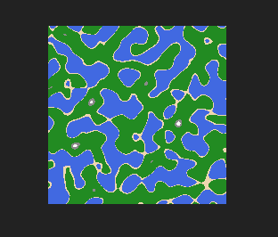

# Python Map Generator
numpy, perlin_noise, PIL,
Requirements: 
Generates simple maps based on perlin-noise generated random numbers!
Below is an example generatation, has many variables to tweak for interesting new results.  

